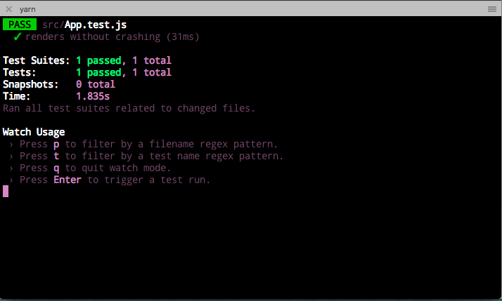

# Testing in React with Jest & React Testing Library

## Learning Objectives (5 min / 0:05)
- Understand the importance of testing in software development.
- Explain the purpose of the React Testing Library and how it works.
- Write tests using React Testing Library to check the functionality of a simple counter component.
- Debug and troubleshoot tests that do not pass.
- Apply their understanding of React Testing Library to test other React components in their projects.

* What is automated testing?
## Quick Review (5 min / 0:10)

<details><summary>Answer</summary>
When we write code to test our other code!</details>


* Why is it helpful?

<details><summary>Answer</summary>
when you create a larger application, the codebase will become bigger and more complex every time you add some features. At some point, adding code in file A will break features in file B, and to avoid these "side-effects" or at least recognize immediately when they happen, we need to write tests our app and run them on each change.</details>


* What tools did we use to test Express apps?

<details><summary>Answer</summary>
Mocha, Chai, SuperTest</details>


* What types of testing are there?

<details><summary>Answer</summary>
Smoke, functional, regression, performance, usability, security, compatibility, recovery, user acceptance, unit, integration, end-to-end, manual, automated
</details>


## What is Jest?
Jest is an easy to configure testing framework built by Facebook for testing JavaScript code. Jest runs your tests for you automatically when you have it in watch mode. It runs your tests in node instead of the browser so that they run faster. It also contains the API we will use to actually test our components.

## What is  React Testing Library?
React Testing Library is a popular testing framework used to test React components. The library provides a set of utilities that make it easy to test React components in isolation and ensure that they render correctly and function as expected. The library is based on the philosophy of testing the behavior of components rather than their implementation details.

## Configuration (10 min / 0:20)
Jest automatically looks for files with a `test.js` suffix, or for files in a `__tests__` folder. We will use the suffix today.

run 
```bash
$ npx create-react-app testing-lesson
```

We can run `$ yarn test` right now and see what happens.



We get some feedback from the app that our tests are all passing!

You can see in `App.test.js` that we only have one test right now: `renders without crashing`. We are going to be using Enzyme on top of Jest, so our tests will look different today.

Jest comes completely configured within `create-react-app`, so we don't have to do anything else to get it working. Let's now set up Enzyme.

```bash
$ yarn add  @testing-library/react @testing-library/jest-dom @testing-library/user-event jest
```

## What is Test Driven Development?
Test driven development is a development strategy where you write the tests first and then your code second. The tests should fail first, then you should write the minimum code necessary to make that test pass, then refactor to make the code cleaner. Then the cycle starts again with a new test! We will be using test driven development today. [Here](https://www.madetech.com/blog/9-benefits-of-test-driven-development) is an article about the benefits of test driven development.

## We Do: Hello World

In your App.js

```js

export default function App () {
 return(<div> Hello World </div>)
}

```

In your App.test.js

```js
import React from 'react';
import { render } from '@testing-library/react';
import App from './App';

test('renders App component', () => {
  const { getByText } = render(<App />);
  const linkElement = getByText(/Hello World/i);
  expect(linkElement).toBeInTheDocument();
});

```

This test renders the App component and checks if it contains an element with the text "Hello World".


## You Do: Writing Tests for a Counter App (30 min / 0:50)

For this exercise, you will be using test driven development to write the React code to pass some pre-written tests. 

We want to build a counter app. When we press a button, we want a number stored in state to increase, and when we press a second button that number will decrease. Given the following tests, write a React component that passes the following tests.

Let's create a folder and some files for our counter app.
```bash
$ mkdir src/components/Counter
$ touch src/components/Counter.{js,test.js}
```

Copy the following code into `Counter.test.js`:
```js
import React from "react";
import { render, screen, fireEvent } from "@testing-library/react";
import Counter from "./Counter";

test("renders initial count of zero", () => {
  const { getByText } = render(<Counter />);
  const countElement = getByText(/count: 0/i);
  expect(countElement).toHaveTextContent("Count: 0");
});

```

1. 
```js
test('renders Counetr', () => {
  render(<Counter />);
  const heading = screen.getByRole('heading', { name: /Counter/i });
  expect(heading).toBeInTheDocument();
});
```

2.
```js
 test("increments count when increment button is clicked", () => {
  const { getByText } = render(<Counter />);
  const countElement = getByText(/count: 0/i);
  const incrementButton = getByText(/increment/i);

  fireEvent.click(incrementButton);

  expect(countElement).toHaveTextContent("Count: 1");
});

```

3. 

```js
 test("decrements count when decrement button is clicked", () => {
  const { getByText } = render(<Counter />);
  const countElement = getByText(/count: 0/i);
  const dercrementButton = getByText(/decrement/i);

  fireEvent.click(decrementButton);

  expect(countElement).toHaveTextContent("Count: -1");
});

```


## Break (10 min / 1:00)

## We Do: Counter Component (60 min / 2:00)

```js
```jsx
import React, { useState } from "react";

function Counter() {
  const [count, setCount] = useState(0);

  const increment = () => setCount(count + 1);

  const decrement = () => setCount(count - 1);

  return (
    <div>
      <h1>Counter</h1>
      <h2>Count: {count}</h2>
      <button onClick={increment}>Increment</button>
      <button onClick={decrement}>Decrement</button>
    </div>
  );
}

export default Counter;
```
## Break (10 min / 1:00)

## We Do: Todo Component (60 min / 2:00)
Create a Todo Component
First, let's create a Todo component that we can test. The Todo component should have a form that allows users to add new items to the todo list, and a list that displays all the current items in the list. The component should also have buttons to mark items as completed and to delete them.

### Here's the code for the Todo component:
```js
import React, { useState } from "react";

function Todo() {
  const [items, setItems] = useState([]);
  const [text, setText] = useState("");

  const handleChange = (event) => setText(event.target.value);

  const handleSubmit = (event) => {
    event.preventDefault();

    if (!text) return;

    setItems([...items, { text, completed: false }]);
    setText("");
  };

  const handleComplete = (index) => {
    const newItems = [...items];
    newItems[index].completed = !newItems[index].completed;
    setItems(newItems);
  };

  const handleDelete = (index) => {
    const newItems = [...items];
    newItems.splice(index, 1);
    setItems(newItems);
  };

  return (
    <div>
      <form onSubmit={handleSubmit}>
        <input type="text" value={text} onChange={handleChange} />
        <button type="submit">Add</button>
      </form>
      <ul>
        {items.map((item, index) => (
          <li key={index}>
            <span style={{ textDecoration: item.completed ? "line-through" : "none" }}>{item.text}</span>
            <button onClick={() => handleComplete(index)}>Complete</button>
            <button onClick={() => handleDelete(index)}>Delete</button>
          </li>
        ))}
      </ul>
    </div>
  );
}

export default Todo;
```

### Test the Todo Component
Now that we have our Todo component, let's write some tests for it using React Testing Library. We'll start by creating a new file called `Todo.test.js` and importing the Todo component:

```js
import React from "react";
import { render, fireEvent } from "@testing-library/react";
import Todo from "./Todo";

```

Next, we'll write our first test. This test will check that the initial todo list is empty when the component first renders. We can use the render function from React Testing Library to render the Todo component and then use the queryByRole function to get the unordered list that should contain the todo items. We can then check that the list is empty:

```js
test("renders empty todo list", () => {
  const { queryByRole } = render(<Todo />);
  const listElement = queryByRole("list");
  expect(listElement.children.length).toBe(0);
});

```

Next, we'll test that we can add new items to the todo list by submitting the form. We can use the fireEvent function from React Testing Library to simulate typing in the input field and then submitting the form. We can then check that the new item has been added to the list:

```js
test("adds new item to todo list", () => {
  const { getByLabelText, queryByRole } = render(<Todo />);
  const inputElement = getByLabelText(/add new todo/i);
  const listElement = queryByRole("list");

  fireEvent.change(inputElement, { target: { value: "Walk the dog" } });
  fireEvent.submit(inputElement);

  expect(listElement.children.length).toBe(1);
  expect(listElement.firstChild.textContent).toBe("Walk the dog");
});

```

### Challenge 20min

What else could we test?

## Conclusion
* Why is test driven development helpful?
* What is Jest? How about React testing library?

### Resources

* [Jest](http://facebook.github.io/jest/)

